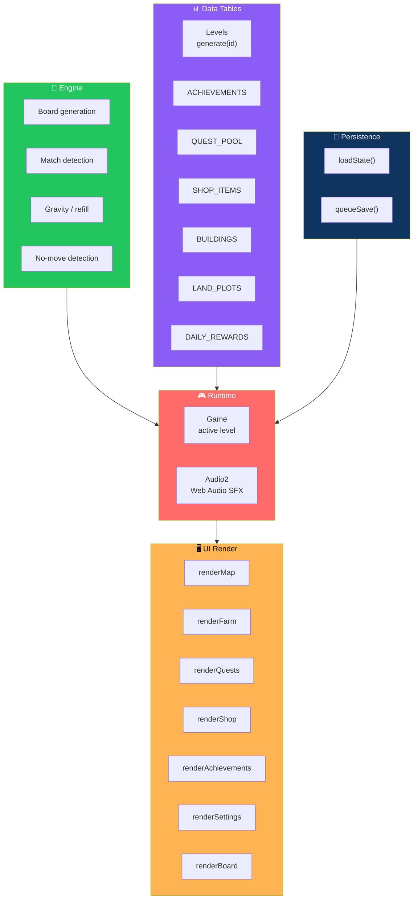

# 🌾 Farm Match

<div align="center">


**Match. Harvest. Build Your Dream Farm.**

*A self-contained, premium-feel Match-3 farming game — playable entirely from a single HTML file.*

[🎮 How to Run](#-how-to-run) • [✨ Features](#-whats-included) • [🏗️ Architecture](#-architecture-notes) • [📝 Scope Notes](#-known-limitations-honest-scope-notes)

</div>

---

## 📖 Overview

**Farm Match** is a **self-contained, premium-feel Match-3 farming game** — playable entirely from a single HTML file, **no install or build step required**.

Match crops, harvest rewards, build your dream farm.

### Core Idea

> **One file. Zero dependencies. A complete farming match-3.**
>
> Open it, play it, come back later — your progress is waiting.

---

## 🚀 How to Run

1. Open **`farm-match.html`** in any modern browser
   - **Chrome** · **Safari** · **Firefox** · **Edge**
2. Works on **desktop, tablet, and mobile** *(tap or click)*
3. **That's it** — no server, no dependencies

### 💾 Automatic Save

Your progress saves automatically as you play and is restored the next time you open the file in the same environment.

**What's saved:**

- Coins
- Gems
- Stars
- Completed levels
- Farm buildings
- Boosters
- Quests
- Achievements
- Settings

---

## ✨ What's Included

<div align="center">

| 🎯 Match-3 Engine | 🌾 Special Crops |
|:---:|:---:|
| 8×8 board · tap-to-select-and-swap · cascades with combo multiplier | Row/Column Harvester · Golden Seed · Farm Bomb |
| **📈 20 Data-Driven Levels** | **⭐ Star Ratings & Rewards** |
| Generated from a difficulty curve — simple → multi-crop → score-attack | Per-level rewards for 1–3 star completions |
| **🏡 Farm Progression** | **🛠️ 11 Upgradable Buildings** |
| Unlockable land plots · Farm Level & XP | Farmhouse · Barn · Chicken Coop · Cow Shed · Vegetable Garden · Windmill · Water Tower · Market · Bakery · Workshop · Orchard |
| **📜 Quests** | **🏆 Achievements** |
| Rotating pool with claimable rewards | Auto-tracked with claimable rewards |
| **🛒 Shop** | **🎁 Daily Rewards** |
| Spend coins/gems on boosters or an extra life | 7-day daily login reward cycle |
| **❤️ Lives System** | **⚙️ Settings** |
| Time-based regeneration | Music · sound · reduced-motion · reset progress |
| **👋 First-Time Tutorial** | **🔊 Procedural Audio** |
| A short tutorial on Level 1 | Lightweight Web Audio SFX — no external files |

</div>

### 🎯 Match-3 Engine

- **8×8 board**
- **Tap-to-select-and-swap**
- **Cascades** with a combo multiplier
- **Automatic shuffle** if no valid move remains

### 🌾 Special Crops

| Match | Result | Effect |
|-------|--------|--------|
| **4 in a row** | 🚜 **Row/Column Harvester** | Clears a full line |
| **5 in a row** | 🌟 **Golden Seed** | Clears every crop of that type |
| **L/T-shaped match** | 💣 **Farm Bomb** | Clears a 3×3 area |

Plus:

- **Weed obstacles** — clear when a crop next to them is matched
- **Automatic shuffle** when no valid move remains

### 📈 20 Data-Driven Levels

Levels are generated from a **difficulty curve**:

- **Simple harvest goals** → **Multi-crop goals with weeds** → **Score-attack goals with fewer moves**
- **Star ratings** per level
- **Per-level rewards**

### 🏡 Farm Progression

- **Unlockable land plots**
- **11 upgradable buildings:**
  - Farmhouse
  - Barn
  - Chicken Coop
  - Cow Shed
  - Vegetable Garden
  - Windmill
  - Water Tower
  - Market
  - Bakery
  - Workshop
  - Orchard
- **Farm Level & XP**

### 🎮 Meta-Game Systems

| System | Details |
|--------|---------|
| **Quests** | Rotating pool with claimable rewards |
| **Achievements** | Auto-tracked with claimable rewards |
| **Shop** | Spend coins/gems on boosters or an extra life |
| **Boosters** | Extra Moves · Farm Hammer · Rainbow Seed · Tractor · Water Bucket |
| **Daily Rewards** | 7-day login reward cycle |
| **Lives** | Time-based regeneration |
| **Settings** | Music / sound toggle · reduced-motion mode · reset progress |
| **Tutorial** | Short first-time tutorial on Level 1 |

### 💾 Persistent Save

Progress is saved using the app's **built-in storage** — refreshing or reopening the file does **not** reset progress.

### 🔊 Audio

**Lightweight generated sound effects** via Web Audio — **no external audio files needed**.

---

## 🏗️ Architecture Notes

Everything lives in **one HTML file** for portability — but the code is organized into **clearly separated sections** that mirror a modular design.



### Section Breakdown

| Section | Responsibility |
|---------|---------------|
| **`Engine`** | Board generation · match detection · gravity/refill · no-move detection |
| **`Levels`** | Data-driven level generator (`Levels.generate(id)`) — **easy to extend well past 20 levels** |
| **`ACHIEVEMENTS` / `QUEST_POOL` / `SHOP_ITEMS` / `BUILDINGS` / `LAND_PLOTS` / `DAILY_REWARDS`** | Plain data tables — **easy to tune or extend** |
| **`Audio2`** | Small Web Audio helper for sound effects |
| **`State` + `loadState()` / `queueSave()`** | Save/load layer — **structured so a real backend could replace the storage calls later** |
| **`Game`** | The active runtime for whichever level is currently in progress |
| **UI render functions** | One function per screen — `renderMap`, `renderFarm`, `renderQuests`, `renderShop`, `renderAchievements`, `renderSettings`, `renderBoard`, etc. |

> 💡 **This makes it easy to split into separate files later** if you want a bundler-based project instead — each section maps directly to a module.

---

## 📝 Known Limitations (Honest Scope Notes)

<div align="center">

| Area | Current State | What's Needed |
|------|--------------|---------------|
| **Levels** | 20 included *(not the full 500+ envisioned)* | Add more is a **one-line change** to `Levels.TOTAL` plus tuning the generator's tiers |
| **Farm decorations & wandering animals** | Represented in the data model | No drag-and-drop placement UI yet |
| **Sound** | Generated tones for feedback *(selects, matches, combos, wins/losses)* | Produced music tracks and sound design assets |
| **Worlds** | Only one active — **"Green Meadow"** | The generator already tags a `world` field per level, so more worlds can be added **without restructuring** |

</div>

---

## 📂 File List

```
farm-match/
├── farm-match.html      The complete game
└── README.md            This file
```

---

## 🗺️ Roadmap

### ✅ Current

- [x] Match-3 engine with cascades and combo multiplier
- [x] Three special crops (Harvester, Golden Seed, Farm Bomb)
- [x] Weed obstacles
- [x] Automatic shuffle when no valid move remains
- [x] 20 data-driven levels with difficulty curve
- [x] Star ratings and per-level rewards
- [x] Unlockable land plots and 11 upgradable buildings
- [x] Farm Level & XP
- [x] Rotating quests with claimable rewards
- [x] Auto-tracked achievements
- [x] Shop with boosters and extra lives
- [x] 7-day daily login reward cycle
- [x] Lives system with time-based regeneration
- [x] First-time tutorial
- [x] Settings — music, sound, reduced-motion, reset
- [x] Persistent save via built-in storage
- [x] Procedural Web Audio SFX
- [x] Works on desktop, tablet, and mobile

### 🔜 Future Ideas

- [ ] Additional worlds *(generator already supports it)*
- [ ] More levels beyond 20 *(one-line change)*
- [ ] Drag-and-drop farm decoration placement
- [ ] Wandering animals with visual presence
- [ ] Produced music tracks
- [ ] Additional booster types
- [ ] Friend system or leaderboards
- [ ] Timed challenges
- [ ] Seasonal events
- [ ] Backend save sync *(storage layer is already abstracted)*

---

## 🤝 Contributing

Contributions are welcome. Please:

1. Fork the repository
2. **Keep it single-file** — no external dependencies or assets
3. **Keep it data-driven** — levels, quests, achievements, shop items, and buildings are data tables, not hard-coded logic
4. **Preserve the section separation** — one concern per section, each clearly labelled
5. **Preserve the persistence layer** — new state must go through `State` and `queueSave()`
6. Test on both desktop and mobile
7. Submit a Pull Request

### Guidelines

- **Never add a required external dependency** — no frameworks, no bundlers
- **Never ship copyrighted assets** — everything must be generated in code
- **Never break the save system** — refreshing must never lose progress
- **Never bypass the difficulty curve** — new levels should slot into the existing tiers
- **Preserve accessibility** — tap and click must both work; reduced-motion mode must be honored

---

## 📜 License

MIT — free to use, modify, and distribute.

---

## 🙏 Acknowledgments

- **Canvas 2D** — for making procedural crops this satisfying
- **Web Audio API** — for a game with zero audio files
- **Every farmer who's ever matched three in a row** — this game is for you

---

<div align="center">

### 🌾 MATCH. HARVEST. BUILD YOUR DREAM FARM.

**One file. Zero dependencies. A complete farming match-3.**

<br>

⭐ If you enjoyed this game, consider giving it a star.

<br>

[⬆ Back to Top](#-farm-match)

</div>
